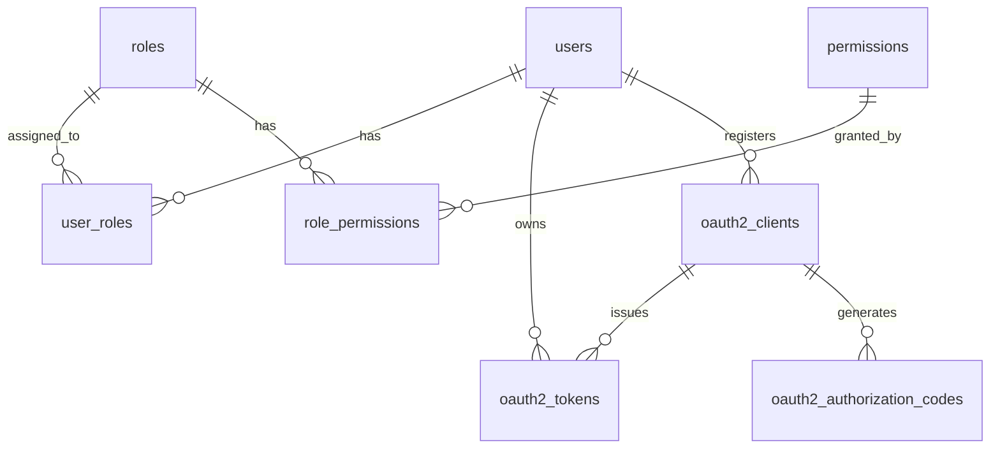

# UMS 数据库设计

## ER 图（Mermaid）

## 核心表结构

| 字段 | 类型 | 说明 |
|------|------|------|
| users.uuid | UUID UNIQUE | 对外暴露 ID |
| users.password_hash | VARCHAR(255) | bcrypt cost=12 |
| users.status | SMALLINT | 1=active 2=disabled 3=locked |
| users.mfa_secret | VARCHAR(64) | AES-256-GCM 密文 |
| oauth2_clients.client_id | VARCHAR(64) UNIQUE | OAuth 流程 |

## 索引策略

| 表 | 字段 | 类型 |
|------|------|------|
| users | email | UNIQUE B-tree |
| users | uuid | UNIQUE B-tree |
| user_roles | user_id, role_id | PRIMARY KEY |
| oauth2_authorization_codes | code, expires_at | 复合 |
