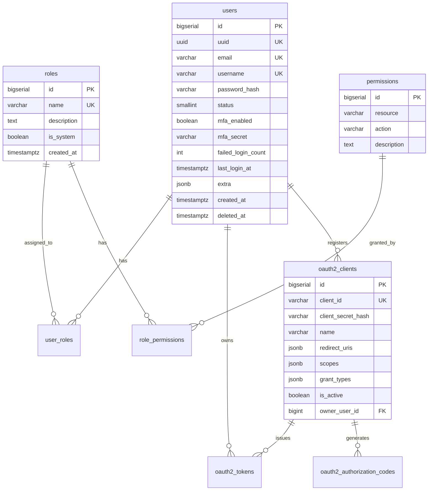

# UMS 数据库设计

## ER 图（Mermaid）

## 核心表结构

### users
| 字段 | 类型 | 说明 |
|------|------|------|
| id | BIGSERIAL PK | 内部主键 |
| uuid | UUID UNIQUE | 对外暴露 ID |
| email | VARCHAR(255) UNIQUE | 登录凭证 |
| password_hash | VARCHAR(255) | bcrypt cost=12 |
| status | SMALLINT | 1=active 2=disabled 3=locked |
| mfa_enabled | BOOLEAN | TOTP 开关 |
| failed_login_count | INT | 连续失败次数 |
| deleted_at | TIMESTAMPTZ | 软删除 |

### 索引策略
| 表 | 字段 | 类型 | 目的 |
|------|------|------|------|
| users | email | UNIQUE B-tree | 登录查询 |
| users | uuid | UNIQUE B-tree | 外部 ID 查询 |
| users | status, deleted_at | 复合 | 活跃用户过滤 |
| user_roles | user_id, role_id | PRIMARY KEY | 唯一性 |
| oauth2_clients | client_id | UNIQUE | OAuth 流程 |
| oauth2_authorization_codes | code, expires_at | 复合 | 授权码验证 |
