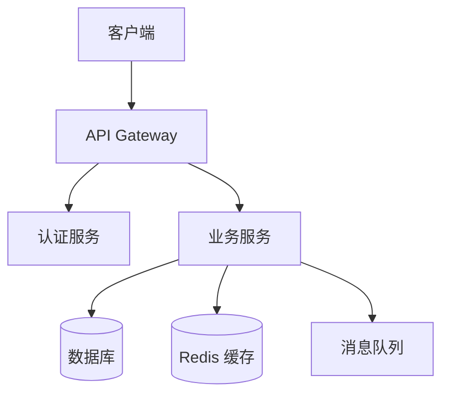

# 阶段二：系统设计 实施手册

**执行角色**：系统设计师
**Skill 文件**：`.claude/skills/designer.md`
**目标分支**：`stage/design`
**前置条件**：阶段一 PR 已合并到 develop

---

## Step 1：启动并激活设计师角色

```bash
claude

> 需求分析阶段已完成，请以系统设计师身份开始阶段二
```

Claude Code 自动加载 `.claude/skills/designer.md`，读取 PRD 和用户故事。

```bash
git checkout develop && git pull
git checkout -b stage/design
```

---

## Step 2：架构设计

```
> 请根据 docs/requirements/PRD.md，设计系统架构，生成 docs/design/architecture.md
```

Claude Code 会产出以下内容：

**架构文档必须包含**：

| 章节 | 说明 |
|------|------|
| 整体架构图 | 用 Mermaid 绘制分层架构 |
| 模块划分 | 每个模块的职责说明 |
| 技术选型 | 选型理由（性能/生态/团队熟悉度）|
| 部署架构 | 环境划分（dev/staging/prod）|
| 关键设计决策（ADR）| 重要设计决策记录 |

**示例架构图（Mermaid）**：


---

## Step 3：数据库设计

```
> 请设计数据库模型，生成 docs/design/database.md，包含 ER 图和 DDL
```

**数据库设计要求**：

```markdown
## 设计原则
- 第三范式，避免数据冗余
- 所有表必须有 created_at / updated_at / deleted_at
- 软删除优先（deleted_at 字段）
- 索引策略：查询字段 + 外键 + 联合索引

## ER 图（Mermaid）
erDiagram
    USER ||--o{ ORDER : places
    ORDER ||--|{ ORDER_ITEM : contains

## DDL 示例
CREATE TABLE users (
    id          BIGINT PRIMARY KEY AUTO_INCREMENT,
    email       VARCHAR(255) UNIQUE NOT NULL,
    password    VARCHAR(255) NOT NULL,
    created_at  DATETIME DEFAULT CURRENT_TIMESTAMP,
    updated_at  DATETIME ON UPDATE CURRENT_TIMESTAMP,
    deleted_at  DATETIME
);
```

---

## Step 4：API 接口设计

```
> 请设计 RESTful API，覆盖所有 P0 用户故事，生成 docs/design/api-design.md
```

**API 设计规范**：

```
基础规范：
- BaseURL:  /api/v1
- 认证方式: Authorization: Bearer <JWT>
- 响应格式: { "code": 0, "message": "ok", "data": {} }
- 分页格式: { "list": [], "total": 100, "page": 1, "page_size": 20 }

错误码规范：
- 0      成功
- 400xx  客户端错误（参数错误、未授权等）
- 500xx  服务端错误

接口文档格式：
### POST /api/v1/auth/login

**描述**：用户登录

**请求体**：
| 字段 | 类型 | 必填 | 说明 |
|------|------|------|------|
| email | string | ✅ | 邮箱 |
| password | string | ✅ | 密码（明文，HTTPS传输）|

**响应**：
{ "code": 0, "data": { "token": "xxx", "expires_at": "2026-01-01" } }

**错误码**：
- 40001: 账号或密码错误
- 40002: 账号已锁定
```

---

## Step 5：UI 原型说明

```
> 请描述核心页面的交互逻辑，生成 docs/design/ui-prototype.md
```

内容包括：核心页面的文字线框图、页面跳转逻辑图（Mermaid flowchart）、关键交互状态。

---

## Step 6：设计评审与提交 PR

```bash
# 自检
> 请检查设计文档是否完整，所有 P0 功能是否有对应 API 设计

git add docs/design/
git commit -m "docs(design): 完成系统架构、数据库、API 设计"
git push origin stage/design
```

在 GitHub 创建 PR：`stage/design` → `develop`

---

## 阶段完成标准

- [ ] 架构设计通过技术 Leader Review
- [ ] API 设计覆盖所有 P0 用户故事
- [ ] 数据库设计已评审，无重大问题
- [ ] PR 已合并到 develop
- [ ] 已通知开发工程师启动阶段三
